# 算法笔记

> 基于胡凡《算法笔记》

[TOC]


## 1. 前置知识

### 1.1 常见评测结果

* Accepted AC
* Compile CE
* Wrong Answer WA
* Time Limit Exceeded TLE
* Runtime Error RE
* Memory Limit Exceeded MLE
* Presentation Error PE
* Output Limit Exceeded OLE

### 1.3 C语言前置知识

* 类型

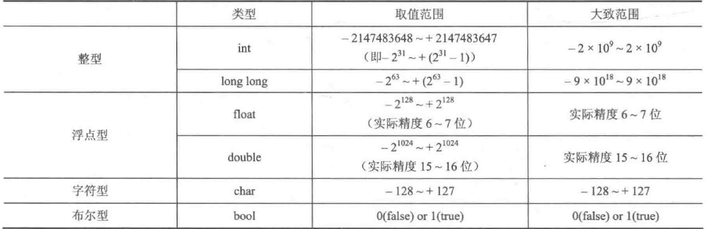

* `#define 标识符 任何语句或片段`

```c
#include <stdio.h>
#define ADD(a, b) ((a) + (b))

int main() {
    int num1 = 3, num2 = 5;
    printf("%d",ADD(num1, num2));
    return 0;
}
```

注意，宏定义是直接将对应的部分替换，所以最好加上许多括号来限制范围，如下面的例子就因为限制太少而失去了原本的意思。

```c
#define CAL(x) (x * 2 + 1)

int main() {
    printf("%d", CAL(a + 1));
    return 0;
}
```

* scanf()取地址符的问题

由于数组名字本身就代表第一个元素的地址，因为不需要加取地址运算符。总结而言，C语言中，**除了char数组整个输入情况不加&之外，其它变量类型都需要加&**。

* getchar()和putchar()

前者用来输入单个字符，后者输出单个字符。

```c
int main() {
    char c1 = getchar();
    putchar(c1);
    
    return 0;
}
```

* typedef

给一个复杂的数据类型起一个别名。

```c
#include <cstdio>
typedef long long LL;

int main() {
    LL a = 123412345423;
   	LL b = 34234234;
    printf("%lld", a + b);
    
    return 0;
}
```

### 1.4 数组

* 冒泡排序

冒泡的本质在于交换，每次将剩余元素的最大值通过交换的方式移到另一端，当剩余元素减少为0时，排序即结束。

```cpp
# 冒泡排序基本写法
for (int i = 0; i < n - 1; i ++) // 表示趟数
    for (int j = 0; j < n - 1 - i; j ++) // 表示遍历
        if (a[j] > a[j + 1])
            swap(a[j], a[j + 1]);

# 冒泡排序优化写法
bool flag = false;
for (int i = 0; i < n - 1; i ++) {
    flag = false;
    for (int j = 0; j < n - i - 1; j ++)
        if (a[j] > a[j + 1]) {
            swap(a[j], a[j + 1]);
            flag = true;
        }
    if (!flag) break; // 某一趟没有交换，即认定已经有序
}
```

* memset——对数组中每一个元素赋相同的值

需要注意的是，**由于memset是按字节赋值，因此建议只赋值0或1**。`memset(数组名，值，sizeof(数组名))`

```cpp
int a[10];
memset(a, -1, sizeof(a));
for (int i = 0; i < 10; i ++)
    cout << a[i] << endl;
```

可以看到，**只有赋值0和-1，整体才都是0和-1**，赋值其他数，由于是字节的原因，和自然数不是一一对应。原因是0的二进制数全为0，-1的二进制数全是1。

* gets输入，puts输出

前者输入一行字符串，后者输出一行字符串，并紧跟一个换行。

* sscanf和sprintf

可以理解为string + scanf和string + printf。对于scanf和printf，可以扩写为下面形式：

```cpp
scanf(screen, "%d", &n);
printf(screen, "%d", n);
// scanf相当于从左到右，将screen的东西以%d格式给n
// printf相当于从右到左，将n以%d格式到screen

int n = 123;
char str[100];
sprintf(str, "%d", n);
printf("%d", str);
```

### 1.5 指针

* **指针与变量**

如果将1字节看成是一个房间，而int是占4字节，即4个房间。int变量的地址是指第1个房间号。需要记住一句话，**指针就是变量的地址。**

每一个变量都有地址，可以使用&来取地址：

```cpp
int main() {
	int a = 10;
	printf("%d %d\n", &a, a);
	
	return 0;
}
```

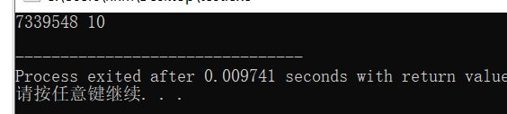

另外，**指针是一个unsigned类型的整数。**

**指针变量用来存放指针，即存放地址。**

定义指针变量时需要注意，不能同时定义多个指针变量。

```cpp
int* p1, p2; // p2此时是int类型
int* p1, *p2, *p3; // 正确定义
```

那么，我们建立变量和指针的联系常常是依靠这种方式：使用`&`将变量地址取出来，赋值给对应类型的指针变量。

```cpp
int a;
int* p = &a;

// 或者
int a;
int *p;
p = &a;
```

从这里我们可以看出，**`p`才是变量名，而不是`*p`，因此我们常常认为类似`int*`是一种单独得数据类型。**

那如何通过地址反推会该地址存储的数呢，也是使用`*`，即可以将**星号*视为一把开启房间的钥匙。**：

```cpp
int a;
int *p = &a;
a = 233;
printf("%d\n", *p); // 233
```

从上面也可以看出，**地址所在的房间内的东西改变了，但是不会影响它的地址。**

* **指针与数组**

**对于数组a，a == &a[0]。**

* **使用指针变量作为函数参数**

将指针变量作为函数参数时，**如果改变这个指针变量所存的数据，则原先数据确实会被改变。**

```cpp
void change(int *p) {
	*p = 233;
}

int main() {
	int a = 1;
	int *p = &a;
	
	change(p);
	printf("a的值是：%d\n", a);
	
	return 0;
}
```

可以用来破解经典的交换函数不交换问题：

```cpp
# 交换函数不交换
void swap(int a, int b) {
	int tmp = a;
	a = b;
	b = tmp;
}

int main() {
	int a = 2, b = 3;
	printf("交换前，a = %d b = %d\n", a, b);
	swap(a, b);
	printf("交换后，a = %d b = %d\n", a, b);
	
	return 0;
}
```

上述现象产生的原因是因为，本质上swap函数中使用了两个参数去接收传进来的值，也就是说，swap函数中a和b只是a和b的两个副本，地址不同，修改后当然也无法影响原来的变量。

```cpp
# 使用指针变量实现交换
void swap(int *a, int *b) {
	int tmp = *a;
	*a = *b;
	*b = tmp;
}

int main() {
	int a = 2, b = 3;
	int *pa = &a, *pb = &b;
	printf("交换前，a = %d b = %d\n", a, b);
	swap(pa, pb);
	printf("交换后，a = %d b = %d\n", a, b);
	
	return 0;
}
```

### 1.6 引用

**引用就是取别名。**

```cpp
# 引用实现交换功能
void swap(int &a, int &b) {
	int tmp = a;
	a = b;
	b = tmp;
}

int main() {
	int a = 2, b = 3;
	printf("交换前，a = %d b = %d\n", a, b);
	swap(a, b);
	printf("交换后，a = %d b = %d\n", a, b);
	
	return 0;
}
```

**引用并不是取地址的意思。**

### 1.7 结构体（struct）的使用

结构体内部不能定义自己这种类型（会引起循环定义问题），但是可以**定义自身类型的指针变量。**

```cpp
struct node {
    node n;     // 不能定义node型变量
    node* next; // node* 型指针变量
}
```

* `.` 和`->`操作

可以使用`.` `->` 来访问结构体中元素，以下面为例：

```cpp
struct studentInfo {
    int id;
    char name[20];
    studentInfo* next;
}stu, *p;
```

正常如果只有`*`的话，访问应该是：

```cpp
stu.id;
stu.name;
stu.next;

(*p).id;
(*p).name;
(*p).next;
```

为了更加简洁，对于结构体指针变量内元素有了`->`写法：

```cpp
p->id;
p->name;
p->next;
```

* 构造函数

由于结构体后续可能会有函数和许多变量常量，因此引入构造函数统一初始化，**构造函数不需要写返回类型，且函数名与结构体名相同。**

```cpp
struct studentInfo {
    int id;
    char gender;
    studentInfo(int _id, char _gender) {
        id = _id;
        gender = _gender;
    }
}
```

### 1.8 浮点数比较问题

* ==

浮点数由于精度问题，是不能直接进行比较的，因此我们常常认为他们的差在某个精度区间，就认为相等。

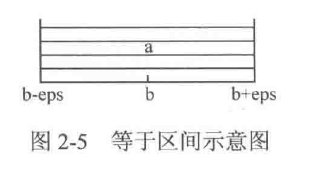

```cpp
#include <cstdio>
#include <cstring>
#include <iostream>

using namespace std;

#include <cmath>
const double eps = 1e-8;

#define Equ(a, b) ((fabs((a) - (b))) < (eps)) 

int main() {
	double db = 1.23;
	if (Equ(db, 1.23))
		printf("True");
	else printf("False");
	
	return 0;
}
```

* \>和<

需要判断a > b，则意味着a - b的差需要大于设定的精度值，不然就相等了。

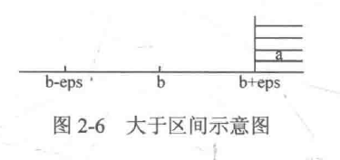

```cpp
#include <cstdio>
#include <cstring>
#include <iostream>

using namespace std;

#include <cmath>
const double eps = 1e-8;

#define More(a, b) (((a) - (b)) > (eps)) 

int main() {
	double a = 1.2224, b = 1.2223;
	if (More(a, b)) printf("True");
	else printf("False");
	
	return 0;
}
```

小于同理，省略。

* \>=和<=

\>=本质上是>和=的结合，我们需要保证a - b的值不能在左边太远。

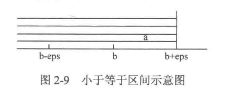

```cpp
#include <cstdio>
#include <cstring>
#include <iostream>

using namespace std;

#include <cmath>
const double eps = 1e-8;

#define MoreEqu(a, b) (((a) - (b)) > (-eps))

int main() {
	double a = 1.2224, b = 1.2223;
	if (MoreEqu(a, b)) printf("True");
	else printf("False");
	
	return 0;
}
```

### 1.9 黑盒测试

* 单点测试

将测试数据分成若干组，每通过一组则累计一定分数。

* 多点测试

一次性运行所有数据，要求程序对所有数据成功才计入分数。

## 2. 排序

### 2.1 选择排序

选择排序的思想是:

> 让 i 从0开始，每次从（i，n）中取最小的数，然后和第i个交换，因此总复杂度为O(n^2)。

```cpp
void selectSort(int a[], int l, int r) {
	for (int i = l; i < r; i ++) {
		int minn = a[i];
		int index = i;
		for (int j = i; j < r; j ++) 
			if (a[j] < minn) {
				minn = a[j];
				index = j;
			}
			
		{
			int tmp = a[i];
			a[i] = a[index];
			a[index] = tmp;
		}
	}
}
```

### 2.2 插入排序

这里介绍最简单的**直接插入排序。**其思想是：

>  对于序列A[1]~A[n]，令i从2到n枚举，枚举n-1趟。在某一趟时，范围1~i已经有序，范围（i + 1，n）未有序，那么遍历A[i + 1]~A[n]，对每个数，遍历A[1]~A[i]，找到合适的位置进行插入。总时间复杂度为O(n^2)。

```cpp
void insertSort(int a[], int l, int r) {
	for (int i = l + 1; i < r; i ++) {
		int tmp = a[i], j = i;
		while (tmp < a[j - 1] && j > l) {
			a[j] = a[j - 1];
			j --;
		}
		a[j] = tmp;
	}
}
```

### 2.3 sort函数和cmp函数

以下面结构体为例，讲解sort()函数和cmp()函数。

```cpp
struct Student {
    char name[10]; // 姓名
    char id[10]; // 准考证号
    int score; // 分数
    int rank; // 排名
}stu[10000];
```

以要求：分数高的优先，分数相同的以字典序排序。

```cpp
bool cmp(Student a, Student b) {
    if (a.score != b.score) return a.score > b.score;
    else return strcmp(a.name, b.name) < 0;
}
```

可以看出，cmp函数将优先级高的一项 == true返回，比如要求分数高，则返回（高 > 低 == true）。

## 3. 散列

散列的最简单的应用就是把输入的数作为数组下标来对这个数的性质进行统计。

但是，一旦遇见某些数的大小超过了10^5，拿来做下标就不合适了，因此我们会将其映射到某个较低的元素，**即将元素通过一个函数转换成整数，并且使该整数尽可能唯一代表这个元素。**其中散列函数的选择尤为关键，下面是常见的散列函数：

* 除留取余法 

$$
H(key) = key \% mod
$$

而当数字过多时，H(key1)和H(key2)很容易相同，即“冲突”现象。解决冲突常用方法如下：

* 线性探查法

当映射后发现这个位置已经被其它元素占用时，则使用H(key)+ 1位置，如果仍被占用，继续向后推。缺点是很容易发生扎堆现象。

* 平方探查法

为避免扎堆现象，可以使用H(key) + 1^2、H(key) + 2^2、H(key) + 3^2这种方式来往后推。

* 链地址法

链地址法思想是不解决冲突，而是将H(key）相同的key连接成一条单链表。

一般而言，使用unorder_map即可。

##  4. 递归

### 4.1 分治

分治步骤：分解->解决->合并

### 4.2 递归

递归边界

递归式

这里来以全排列为例子，详解递归分治的思想。

全排列是求1-n，这n个数自由组合的排列个数。可以以第1位为分类，分解为第1位是1...n这n中情况，然后对于后面的也是如此分解，比如第二位可以分解为n-1中情况。

具体到代码上，我们可以开辟一个大小为n的P数组，用来存储临时排列。使用index去遍历1-n，同时使用hashTable数组来标记某个数字有无使用过。当index == n + 1时，表示某次遍历深度已经到底了。

```cpp
#include <cstdio>

const int maxn = 10;
int n;
int P[maxn];
bool hashTable[maxn]; 

void generateP(int index) { // 可以认为index是指排列的坑位，即第1个坑、第2个坑。。。第n个坑 
	if (index == n + 1) {
		for (int i = 1; i <= n; i ++) 
			printf("%d ", P[i]);
		printf("\n");
	}
		
	
	for (int i = 1; i <= n; i ++) {
		if (!hashTable[i]) {
			P[index] = i;
			hashTable[i] = true; // 表示使用 
			
			generateP(index + 1); // 继续处理下一个坑
			hashTable[i] = false; // 回过头来继续处理当前坑的另外的情况 
		}	
	}
}

int main() {
	n = 4;
	generateP(1);
	
	return 0;
}
```

N皇后问题亦是如此，不赘述。

## 5. 贪心

额、额，嗯。

## 6. 二分

针对单调序列且无重复元素，一般使用非递归。

```cpp
int binarySearch(int a[], int left, int right, int x) {
	int mid;
	while (left <= right) {
		mid = left + right >> 1;
		if (a[mid] == x) return mid - 1;
		else if (a[mid] > x) right = mid - 1;
		else left = mid + 1;
	}
	
	return -1;
}
```

对于单调有重复元素序列，找出第一个大于等于x的位置L和第一个大于x的位置R，这样x在**序列中的存在区间就是[L, R)。**

求解L：

```cpp
int binarySearch(int a[], int left, int right, int x) {
	int mid;
	while (left < right) { // 注意这里不同 
		mid = left + right >> 1;
		if (a[mid] >= x) right = mid;
		else left = mid + 1;
	}
	
	return left;
}
```

求解R：

```cpp
int binarySearch(int a[], int left, int right, int x) {
	int mid;
	while (left < right) { // 注意这里不同 
		mid = left + right >> 1;
		if (a[mid] > x) right = mid;
		else left = mid + 1;
	}
	
	return left;
}
```

模板通解：

```cpp
int binarySearch(int a[], int left, int right, int x) {
	int mid;
	while (left < right) { // 对[left, right]，left==right意味着找到了唯一位置
		mid = left + right >> 1;
		if (条件成立) right = mid;
		else left = mid + 1;
	}
	
	return left;
}
```

## 7. 快速幂

快速幂也被称为二分幂，是基于二分的思想。求解a^b % m。

快速幂基于以下事实：

* 若b为奇数，则a^b = a * a ^ (b - 1)。
* 若b为偶数，则a^b = a^(b/2) * a^(b/2)。

```cpp
LL binaryPow(LL a, LL b, LL m) {
	if (b == 0) return 1;
	if (b % 2 == 1) return a * binaryPow(a, b - 1, m) % m;
	else {
        LL mul = binaryPow(a, b / 2, m); // 减少调用次数
        return mul * mul % m;
    }
}
```

这里有个小技巧：

`if (b % 2 == 1)可以使用if (b & 1)`代替，因为奇数的话末位一定是1，故而和1位与一定为正数。

## 8. 双指针

双指针算是一种编程技巧，最经典的例子是从一个递增的正整数序列中求解两个不同位置，其和为M。

```cpp
i = 0, j = n - 1;
while (i < j) {
    if (a[i] + a[j] == M) {
        printf("%d %d\n", i, j);
        i ++;
        j --;
    }else if (a[i] + a[j] < M)
        i ++;
    else j --;
}
```

## 9. 其他技巧和算法

### 9.1 打表

打表是典型的用空间换时间思维，即先将某些结果计算出来，之后的查询直接取这些结果。

## 10. 数学问题

### 10.1 最大公约数和最小公倍数

之前遇见求解a和b的最大公约数问题，一般我都是直接调用现有函数，或者直接默写：

```cpp
int gcd(a, b) {
    return !b ? a : gcd(b, a % b);
}
```

一直没有机会去搞懂原理，今天看了篇文章，竟然如此简单，证明过程如下：
$$
定义求解a,b最大公约数为gcd(a, b)，算法基于gcd(a, b) = gcd(b, a\%b)，证明如下：\\设a = kb + r,则r = a - kb;\\设d为a和b的一个公约数，则d必定为r的一个约数。\\又r = a \%b，则d为b和a \%b的一个公约数，d具有任意性，即a和b的公约数都是b和a\%b的公约数。\\即gcd(a, b)=gcd(b, a\%b)。
$$

### 10.2 分数的四则运算

常用表示分数的方法是结构体，即

```cpp
struct Fraction {
    int up;   // 分子
    int down; // 分母
}
```

需要满足以下三个条件：

* down必须为非负数，若down为负，则up和down同时取相反数。
* up为0，down为1，则为0。
* up和down没有除了1以外的公约数。

```cpp
// 分数的化简
Fraction reducion(Fractiono result) {
    if (result.down < 0) {
        result.up = -result.up;
        result.down = -result.down;
    }else if (result.up == 0) result.down = 1;
    else {
        int d = gcd(result.up, result.down);
        result.up /= d;
        result.down /= d;
    }
    return result;
}


// 分数的加法
Fraction add(Fraction f1, Fraction f2) {
    Fraction result;
    result.up = f1.up * f2.down + f2.up * f1.down;
    return.down = f1.down * f2.down;
    
    return reduction(result);
}


// 分数的乘法
Fraction multi(Fractiono f1, Fraction f2) {
    Fraction result;
    result.up = f1.up * f2.up;
    result.down = f1.down * f2.down;
    return reduction(result);
}
```

### 10.3 素数

素数的判断基于以下事实：

若在2~n-1中存在n的约数k，则n/k也是一个约数，且k和n/k必然一个小于sqrt(n)，另一个大于sqrt(n)。

```cpp
bool isPrime(int n) {
    if (n <= 1) return false;
    for (int i = 2; i * i < n; i ++)
        if (n % i == 0) return false;
    return true;
}
```

**基于Eratosthenes筛法获取素数表**，其算法思想肥肠地暴力，从小到大枚举每个数，如果为素数，则筛去其倍数，则剩下的全为素数。

```cpp
const int maxn = 101;
int prime[maxn], pNum = 0;
bool p[maxn] = {0};
void Find_Prime() {
    for (int i = 2; i < maxn; i ++)
        if (p[i] == false) { // 说明为素数
        	prime[pNum +++] = i;
            for (int j = i + 1; j < maxn; j += i)
                p[j] = true;
        }
}
```

### 10.4 分解质因子

### 10.5 大整数运算


### 10.6 拓展欧几里得算法

这里重点说一下同余式，a =(三行) b(mod m)，即a模m和b模m的余数相等。

### 10.7 组合数

## 11. STL介绍

### 11.1 vector

vector翻译为向量，实际上常叫做变长数组。

* 通过迭代器访问

迭代器是一种类似指针的东西，定义为`vector<typename>::iterator it;`

```cpp
// 使用下标访问
vector<int> vi;
for (int i = 1; i <= 5; i ++)
    vi.push_back(i);


// 使用迭代器访问
vector<int>::iterator it = vi.begin();
for (int i = 0; i < 5; i ++)
    printf("%d ", *(it + i));
```

* push_back(), pop_back()
* size(), clear()
* erase() 

删除一个区间内所有元素，若为erase(it)则为删除迭代器为it的元素，否则删除左开右闭[first, last)内所有元素。

### 11.2 set

set翻译为集合，是**内部自动有序且不含重复元素**的容器，其中内部为自动递增排序。

其中set只能通过迭代器访问：

```cpp
set<int> st;
st.insert(5);
st.insert(4);
st.insert(13);
st.insert(0);

for (set<int>::iterator it = st.begin(); it != st.end(); it ++)
    printf("%d ", *it);
```

* insert()函数

插入并自动完成递增排序和去重。

* find()函数

返回set中值为value的迭代器。

* erase()函数

删除单独一个元素可以使用迭代器，erase(it)，或者使用value值，erase(value)。

删除区间元素即erase(first, last) 左闭右开。

### 11.3 string

* erase()有两种删除区间

str.erase(first, last)(要求是迭代器格式)和str.erase(pos, length)。

后者常用一些。

```cpp
#include <cstdio>
#include <cstring>
#include <iostream>

using namespace std;

int main() {
	string str = "0123456";
	str.erase(str.begin() + 3, str.begin() + 5);
	cout << str << endl;
	
	str.erase(2, 3);
	cout << str << endl;
	
	return 0;
}
```

* substr()

substr(pos, len)返回从pos开始，len长度的子串。

* find(str2)

当str2是str的子串时，返回第一次出现的位置；若不是子串，则直接返回-1。

### 11.4 map

map翻译为映射，映射到工程中非常有用，**map可以将任何基本类型映射到任何基本类型。**

* 通过下标访问

```cpp
#include <cstdio>
#include <map>
#include <iostream>

using namespace std;

int main() {
	map<char, char> mp;
	mp['c'] = 20;
	mp['a'] = 30;
	printf("%d\n", mp['c']);
	
	return 0;
}
```

* 通过迭代器访问

```cpp
#include <cstdio>
#include <map>
#include <iostream>

using namespace std;

int main() {
	map<char, int> mp;
	mp['c'] = 20;
	mp['a'] = 30;
	mp['d'] = 40;
	
	for (map<char, int>::iterator it = mp.begin(); it != mp.end(); it ++)
		cout << it->first << " " << it->second << endl; 
	
	return 0;
}
```

api与其它类似。

### 11.5 queue

queue翻译为队列，是一种先进先出的限制性数据结构，只能通过front()访问队首，back()访问队尾。

一般的api是push、pop、front、back()。

### 11.6 priority_queue

priority_queue翻译为优先队列，底层是使用堆来实现，并且队首一定是优先级最高的那一个。

其中priority没有front和back两个函数，只有top()函数来访问队首元素，或者说**堆顶元素**。

```cpp
#include <cstdio>
#include <queue>
#include <iostream>

using namespace std;

int main() {
	priority_queue<int> q;
	q.push(3);
	q.push(8);
	q.push(0);
	q.push(13);
	
	cout << q.top() << endl;
	
	return 0;
}
```

常用api是push、pop和top。

重点是如何设置**priority_queue中元素优先级**。

一般而言，数字越大则优先级越高，即对于基本数据类型而言，下面是等价的：
```cpp
priority_queue<int> q;
priority_queue<int, vector<int>, less<int>> q;
```

其中vector<int>是指用来**承载底层数据结构堆（heap）**的容器，而**less<int>表示数字大的优先级越大，greater<int>表示数字小的优先级越大。**

例如如下就是小根堆：

```cpp
#include <cstdio>
#include <queue>
#include <iostream>

using namespace std;

int main() {
	priority_queue<int, vector<int>, greater<int> > q;
	q.push(3);
	q.push(8);
	q.push(0);
	q.push(13);
	
	cout << q.top() << endl;
	
	return 0;
}
```

通过**重载来进行结构体的优先级设置：**

并且，**只能重载小于号，不能重载大于号。**

```cpp
#include <cstdio>
#include <queue>
#include <iostream>

using namespace std;

struct fruit {
	string name;
	int price;
	friend bool operator < (fruit f1, fruit f2) {
		return f1.price > f2.price; // 这里是相反的，特别是和cmp函数相比 
	}
}f1, f2, f3;

int main() {
	priority_queue<fruit> q;
	f1.name = "桃子";
	f1.price = 3;
	f2.name = "梨子";
	f2.price = 4;
	f3.name = "苹果";
	f3.price = 5;
	
	q.push(f1);
	q.push(f2);
	q.push(f3);
	cout << q.top().name << " " << q.top().price << endl;
	
	return 0;
}
```

一定要注意，优先队列的定义和cmp是相反的。

### 11.7 stack

stack翻译为栈，是后进先出的容器。

常用api为push、top、pop等。

### 11.8 algorithm下的常用函数

* fill()

将某一段区间赋为某个相同的值，例如`fill(a, a + 5, 233)`是将a[0]~a[4]赋值给233。

## 12. 数据结构专题

### 12.1 栈的应用

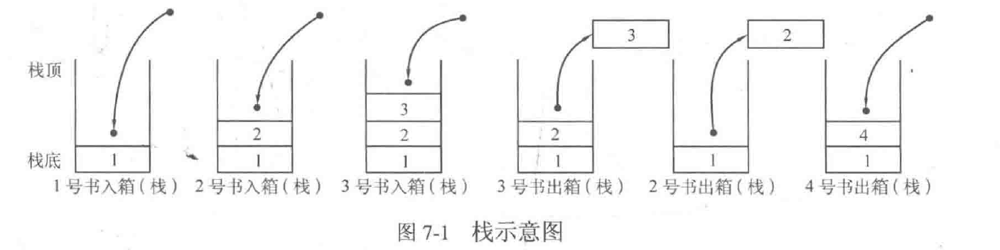

栈的重要一个变量是栈顶指针，栈顶指针是始终指向栈的最上方元素的一个标记。下面我们使用st[]来实现栈，int型变量TOP表示栈顶指针。

```cpp
// 清空 clear
void clear() {
    TOP = -1;
}

// 获取栈内元素个数
void size() {
    return TOP + 1;
}

// 判空empty
void empty() {
    if (TOP == -1) return true;
    else return false;
}

// 进栈push
void push(int x) {
    st[++ TOP] = x;
}

// 出栈pop
void pop() {
    TOP --;
}

// 取栈顶元素top
int top() {
    return st[TOP];
}
```

### 12.2 队列的应用

queue是一种先进先出的数据结构，符合现实生活中排队的类型。

模拟queue时，使用队首指针front(其中**front指向队首前一个位置**）和队尾指针rear辅助模拟。

```cpp
// 清空clear
void clear() {
    front = rear = -1;
}

// 获取队列内元素的个数size
int size() {
    return rear - front;
}

// 判空empty
bool empty() {
    if (front == rear) return true;
    else return false;
}

// 入队push
int push(int x) {
    q[++ rear] = x;
}

// 出队pop,这里要注意，肯定只有队首能出队
void pop() {
    front ++;
}

// 取队首元素
int get_front() {
    return q[++ front];
}

// 取队尾元素
int get_rear() {
    return q[rear];
}
```

### 12.3 链表处理

链表的两个结点之间一般通过一个指针来从一个结点指向另一个结点，则在每个结点中，都分为数据域和指针域。

```cpp
struct node {
    typename data; // 数据域
    node* next; // 指针域
}
```

这里先声明一个重要的概念，头结点，即head，且其数据域不放任何内容，而指针域next指向第一个有内容的结点。
#### 12.3.1 使用malloc函数或者new运算符为结点分配空间

* malloc

malloc用于申请动态内存，返回类型为申请的同变量类型的指针。

```cpp
int* p = (int*)malloc(sizeof(int));
node* p = (node*)malloc(sizeof(node));
```

malloc会返回一个指向该内存空间的指针，类型是void\*，需要通过诸如(int\*)来进行强制类型转换。

* new

new是C++用来申请动态空间的运算符，其返回类型是申请的同变量类型指针。

```cpp
int* p = new int;
node* p = new node;
```

* 内存泄漏

malloc和new都是申请内存，申请完之后就需要释放。

其中malloc对应free、new对应delete运算符。

```cpp
// free的用法
free(p);

// delete的用法
delete(p);
```

#### 12.3.2 创建链表

```cpp
#include <iostream>

using namespace std;

struct node {
	int data;
	node* next;
};

node* create(int Array[], int n) {
	node* head, *p, *pre; // 创建头结点、当前结点、前驱结点
	head = new node;
	head->data = NULL;
	
	pre = head;
	
	for (int i = 0; i < n; i ++) {
		p = new node;
		p->data = Array[i];
		p->next = NULL;
		
		pre->next = p;
		pre = p;
	} 
	
	return head;
}

int main() {
	int Array[5] = {5, 3, 6, 1, 2};
	int n = 5;
	node* L = create(Array, n);
	
	L = L->next;
	while (L) {
		cout << L->data << " ";
		L = L->next;
	}
	
	cout << endl;
	
	return 0;
}
```

#### 12.3.4 查找元素

```cpp
int search(node* L, int x) {
	node* head = L; // 注意这里就不要申请空间
	head = head->next; 
	
	int cnt = 1;
	while (head) {
		if (head->data == x) return cnt;
		else {
			cnt ++;
			head = head->next;
		}
	}
	return -1;
}
```

#### 12.3.5 插入元素

这里的插入要格外注意，**在第3个位置上插入值4是指插入完成之后，第3个结点的值是4。**

```cpp
void insert(node* L, int pos, int x) { // 插入只需要找到插入的前一个位置即可
	node* p = L;
	
	for (int i = 0; i < pos - 1; i ++) 
		p = p->next;
	
	node* tmp = new node;
	tmp->data = x;
	tmp->next = p->next;
	p->next = tmp;
}
```

#### 12.3.6 删除元素

删除元素是指删除链表上值为x的结点。

```cpp
void del(node* L, int x) {
	node* pre = L;
	node* p = L->next;
	
	while (p) {
		if (p->data == x) {
			pre->next = p->next;
			delete(p); // 后面这两步挺重要的 
			p = pre->next;
		}

		p = p->next;
		pre = pre->next;
	}
}
```

## 13. 搜索专题

### 13.1 DFS

如果真的身处迷宫，如何是最高效的寻找出路方法？只要让右手始终贴着右边的墙壁一直行走即可，这种方法会自动执行dfs。

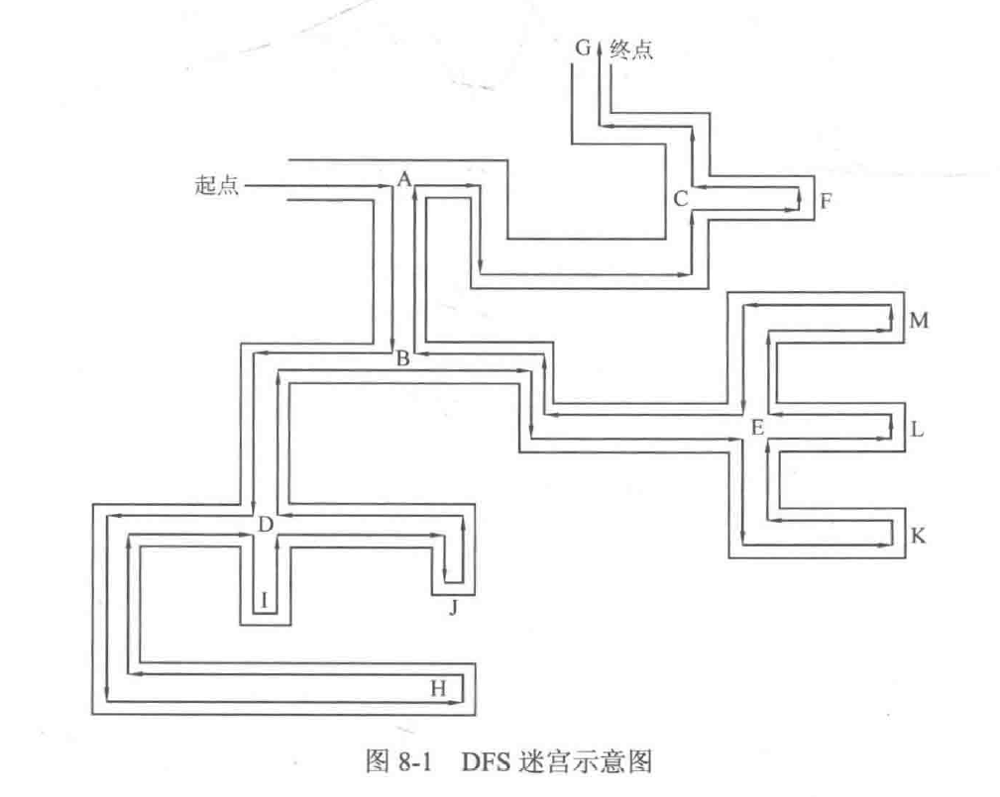

以dfs的角度来理解递归，以Fibonacci为例，将F(n)分为F(n-1)和F(n-2)，即可以理解为岔路口；当遇见递归边界时，可以理解为死胡同，即最深度。

下面是一个典型例子来理解dfs。

> n件物品，每件物品重量为w[i]，价值为c[i]，选出若干件物品放入容量为V的背包中，在物品不超过V的前提下，使价值最高。

```cpp
#include <iostream>

using namespace std;

const int maxn = 30;
int n, V, maxValue = 0; // 物品件数 背包容量 最大价值
int w[maxn], c[maxn]; // 每件物品重量 每件物品价值

void DFS(int index, int sumW, int sumC) { // 物品的编号（坑号） 选中的总重量 选中的总价值
	if (index == n) {
		if (sumW <= V && sumC > maxValue)
			maxValue = sumC; 
		return ;
	}
		
	// 不选中这号物品
	DFS(index + 1, sumW, sumC);
	
	// 选中这号物品
	DFS(index + 1, sumW + w[index], sumC + c[index]);
} 

int main() {
	scanf("%d%d", &n, &V);
	for (int i = 0; i < n; i ++)
		scanf("%d", &w[i]);
	for (int i = 0; i < n; i ++)
		scanf("%d", &c[i]);
	n = 5, V = 8;
	
	DFS(0, 0, 0); // 从第0件物品开始 总重量0, 总价值0
	printf("%d", maxValue); 
	
	return 0;
}
```

### 13.2 BFS

BFS是指遇见岔路口时，先访问该岔路口能直接到达的所有结点，然后按这些结点被访问的顺序去依次访问能直接到达的全部结点。一个绝妙的比喻就是像往平静的水面中投入一颗小石子。

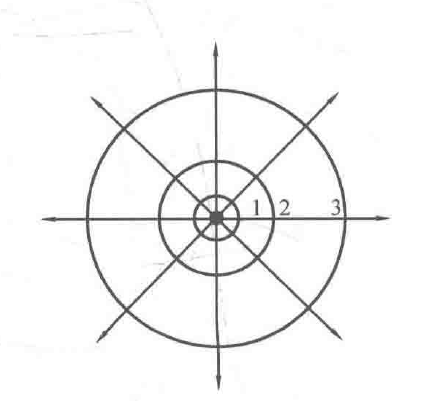

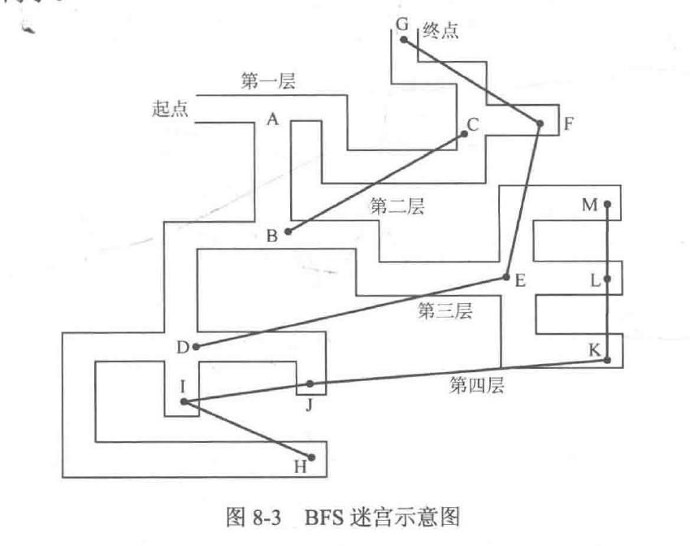

由于BFS总是以一层为处理单位，该层处理完后需要去掉，然后处理下一层，类似于队列的出队和入队，因此BFS常用队列来实现。

以下面简单的例子来讲解BFS算法。

> 给定mxn的矩阵，矩阵元素为0或1，称位置(x, y)和(x + 1, y)，(x -1, y)，(x, y - 1)，(x, y + 1)。若有若干个1是相邻的，则说这些1构成了块，求矩阵中块的个数。

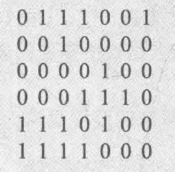

这上面，块的数量是4。

```cpp
#include <iostream>
#include <queue> 

using namespace std;

const int maxn = 30;

struct node {
	int x, y;
}Node;

int n, m; 
int matrix[maxn][maxn];
bool inq[maxn][maxn] = {false};

int X[4] = {0, 0, 1, -1};
int Y[4] = {1, -1, 0, 0};

bool judge(int x, int y) {
	if (x < 0 || x >= m) return false;
	if (y < 0 || y >= n) return false;
	if (!matrix[x][y] || inq[x][y])  return false;
	return true;
}


void BFS(int x, int y) {
	Node.x = x, Node.y = y;
	queue<node> Q;
	Q.push(Node); // 对初始元素加入队列中作为队首 
	
	while (!Q.empty()) {
		node Top = Q.front();  
		Q.pop(); // 取出队首并处理	 
		
		for (int i = 0; i < 4; i ++) {
			int newX = Top.x + X[i];
			int newY = Top.y + Y[i];
			Node.x = newX, Node.y = newY;
			
			if (judge(newX, newY)) {
				Q.push(Node);
				inq[newX][newY] = true;
			}
		}
	}
} 


int main() {
	scanf("%d%d", &n, &m);
	for (int x = 0; x < n; x ++)
		for (int y = 0; y < m; y ++)
			scanf("%d", &matrix[x][y]);
			
	int ans = 0;
	for (int x = 0; x < n; x ++)
		for (int y = 0; y < m; y ++)
			if (matrix[x][y] && !inq[x][y]) {
				ans ++; // 块数 + 1 
				BFS(x, y); // 开始BFS访问整个块 
				inq[x][y] = true; // 也可以在BFS中加入这句话 
			}
	
	printf("%d", ans);
	
	return 0;
}
```

## 14. 数据结构

### 14.1 树与二叉树

常见树的性质：

* 树可以没有结点，即empty tree。
* 树的层次是从根结点开始算起，根结点为第一层，根结点子树为第二层。
* 结点的子树个数称为度，而树中结点最大的度称为树的度。
* 有n个结点，则边数为n-1。
* 叶子结点被定义为度为0的结点。
* 树的深度是从根结点（根结点深度为1）开始自顶向下累加，高度是从最底层叶子结点（高度为1）开始自底向上累加。

**二叉树的递归定义：**

* 空树是二叉树。
* 二叉树的左右子树，要么是空树，要么是二叉树。

**满二叉树和完全二叉树：**

* 满二叉树，每一层的结点个数都达到了最大结点数。

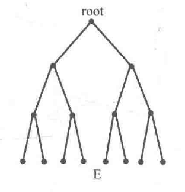

* 完全二叉树

除了最下面一层，其余层的结点个数都达到了当层能达到的最大结点数，且最下面一层只从左至右连续存在若干结点，且连续结点右边结点不存在。

**二叉树的存储结构和基本操作：**

使用二叉链表来定义二叉树。

```cpp
struct node {
    typename data;
    node* lchild;
    node* rchild;
}
```

**二叉树新建结点**

```cpp
// 新建一个结点
node* newNode(int v) {
    node* Node = new node;
    Node->data = v;
    Node->lchild = Node->rchild = NULL;
    return Node;
}
```

**二叉树结点查找和修改**

二叉树的查找是指在给定一个数据x的情况下， **找到二叉树中所有数据域为x的结点，并将结点的数据域改为给定的y。**

```cpp
void search(node* root, int x, int newdata) {
    if (root == NULL) return ;
    if (root->data == x) root->data = newdata;
    
    search(root->lchild, x, newdata);
    search(root->rchild, x, newdata);
}
```

**二叉树的插入**

二叉树的形态各异，而一般是有序的，当需要插入结点值为x的结点时，**一般是插入在查找失败的地方。**

```cpp
void insert(node* &root, int x) {
    if (root == NULL) { // 为空，是插入位置
        root = newNode(x);
        return ;
    }
    if (由二叉树性质，此时应该插在左子树)
        insert(root->lchild, x);
    else insert(root->rchild, x);
}
```

关于要不要加上引用，现在我还是没有理解，摘抄如下，大致就是记住一个原则，一旦修改了指针的值，就需要用引用，而单纯只修改了指针的指向，可以不使用引用。

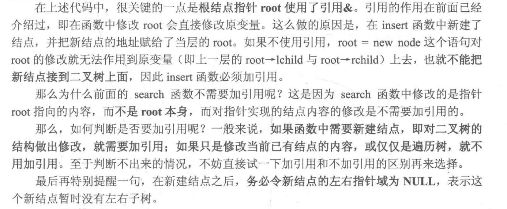

**二叉树的创建**

二叉树的创建一般就是直接插入，一般二叉树是有序的，则只需要有序插入即可。

```cpp
node* Create(int data[], int n){
    node* root = NULL;
    for (int i = 0; i < n; i ++)
        insert(root, data[i]);
   
    return root;
}
```

**root == NULL的意思**

*root == NULL和root== NULL到底有什么区别呢，\*root这种写法是错误的，\*是指取地址，\*root是指取root指针所指的地址，而这无法说明地址root是否为空；而root == NULL是指root指针变量指向的地址是NULL，注意，**root为指针变量**。

### 14.2 二叉树的遍历

* 先序遍历（根左右）

```cpp
void preorder(node* root) {
    if (root == NULL)
        return ;
    
    cout << root->data << endl; // 输出根结点值
    
    preorder(root->lchild);
    preorder(root->rchild); 
}
```

* 中序遍历（左根右）

```cpp
void inorder(node* root) {
    if (root == NULL) return ;
    
    inorder(root->lchild);
    
    cout << root->data << endl;
    
    inorder(root->rchild);
}
```

* 后序遍历（左右根）

```cpp
void postorder(node* root) {
    if (root == NULL) return ;
    
    postorder(root->lchild);
    postorder(root->rchild);
    
    cout << root->data << endl;
}
```

### 14.3 根据先序序列和中序序列重建二叉树

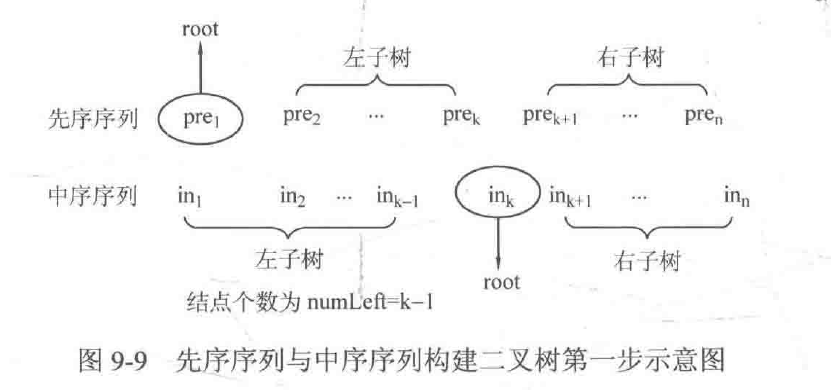

如果先序序列为[preL, preR]（从1开始），中序序列为[inL, inR]（从1开始），设in_k = pre_1，则左子树结点数为k-1个，则左子树的先序区间为[preL+1, preL + 1 + k - 1]，中序区间为[intL, inL + k - 1]，右子树的先序区间为[preL + k + 1, preR]，中序区间为[inL + k + 1, inR]。

如果递归建立的话，当先序区间的长度为0时，即为递归终点。

```cpp
node* create(int preL, int preR, int inL, int inR) {
	if (preL >= preR) return ;
    
    node* root = new node;
    root->data = pre[preL];
    
    int k;
    for (k = inL; k <= inR; k ++)
        if (pre[preL] == in[k])
            break;
    
    int numLeft = k - inL; // 左子树结点个数
    
    root->lchild = create(preL + 1, preL + numLeft, inL, k - 1);
    root->rchild = create(preL +numLeft +1, preR, k + 1, inR);
        
    return root;
}
```

## 15. 二叉查找树（BST）

二叉查找树（Binary Search Tree），其递归定义如下：

* 要么BST是一棵空树。
* 要么BST由根结点、左子树、右子树组成，其中左右子树均为BST，且左子树所有结点的数据域均小于或等于根结点的数据域。

**BST本质上是具有一定顺序的二叉树。**

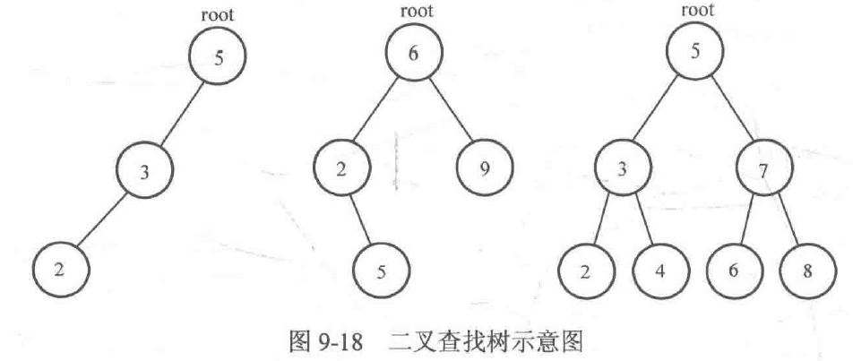

* BST查找操作

```cpp
void search(node* root, int x) {
    if (root == NULL) return ;
    if (root->data == x) {
    	cout << "查找成功！" << endl;
        return ;
    }
    
    if (x < root->data) search(root->lchild, x);
    else search(root->rchild, x);
}
```

* BST插入操作

```cpp
void insert(node* &root, int x) {
    if (root == NULL) {
        root = newNode(x);
        return ;
    }
    
    if (x == root->data) return ;
    else if (x < root->data) insert(root->lchild, x);
    else insert(root->rchild, x);
}
```

* BST建立操作

```cpp
node* Create(int data[], int n) {
    node* root = NULL;
    for (int i = 0; i < n; i ++)
        insert(root, data[i]);
    
    return root;
}
```

* BST删除操作

二叉查找树删除的核心难点是删除之后需要仍然保持二叉查找树的特征。假设删除某个根结点，需要找到另一个结点来代替。有两种替代，一是比根结点小的最大结点，即左子树的最右结点，称为前驱；二是比根结点大的最小结点，即右子树的最左结点，称为后继。

```cpp
node* findMax(node* root) {
    while (root->rchild)
        root = root->rchild;
    return root;
}

node* findMin(node* root) {
    while (root->lchild)
        root = root->lchild;
    return root;
}

void deleteNode (node* &root, int x) {
    if (root == NULL) return ;
    
    if (x == root->data) {
        if (!root->lchild && !root->rchild) { // 直接删除这个结点
        	root = NULL;
        }else if (root->lchild) { // 左子树不为空
        	node* pre = findMax(root->lchild);
            root->data = pre->data;
            deleteNode(root->lchild, pre->data); // 切记不能直接删
        }else { // 右子树不为空
        	node* next = findMin(root->rchild);
            root->data = next->data;
            deleteNode(root->rchild, next->data);
        }
    }else if (x < root->data)
        deleteNode(root->lchild, x);
    else deleteNode(root->rchild, x);
}
```

* BST的重要性质

**对BST进行中序遍历，遍历的结果是有序的**。

中序遍历的顺序是根左右，而BST的大小排序也是根左右，因此可以保证有序。

## 16. 平衡二叉树（AVL树）

BST由于没有限制深度，很可能会出现一些奇形怪状的树，仍然会影响性能。

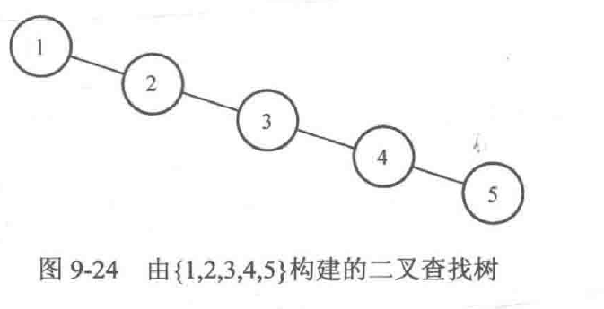

而平衡二叉树（AVL）保证对于任意结点来说，左子树和右子树的高度之差的绝对值不超过1，其中左子树和右子树的高度之差就是平衡因子。

由于每个结点都需要得到平衡因子，而平衡因子是动态变化的，所以我们选择存储高度。

```cpp
struct node {
    int v, height; // v为结点权值，height为当前子树高度
    node* lchild, *rchild; // 左右孩子结点地址
}
```

```cpp
// 新建一个结点
node* newNode(int v) {
	node* Node = new node;
	Node->v = v;
	Node->height = 1;
	Node->lchild = Node->rchild = NULL;
	return Node;
}
```

```cpp
int getHeight(node* root) {
    if (root == NULL) return 0;
    return root->height;
}
```

```cpp
int getBalanceFactor(node* root) {
    return root->lchild->height - root->rchild->height;
}
```

高度是通过子树来求的，即结点root所在子树的height等于其左右子树的height与右子树的height的较大值加1，通过以下函数来更新height：

```cpp
void updateHeight(node* root) {
    root->height = max(getHeight(root->lchild), getHeight(root->rchild)) + 1;
}
```

#### 16.1 AVL查找操作

AVL本质上是BST，查找思路是一样的。

```cpp
void search(node* root, int x) {
    if (root == NULL) return ;
    
    if (x == root->data) {
        cout << "查找成功" << endl;
        return ;
    }else if (x < root->data) 
        search(root->lchild, x);
    else search(root->rchild, x);
}
```

#### 16.2 AVL插入操作

* AVL的左旋

  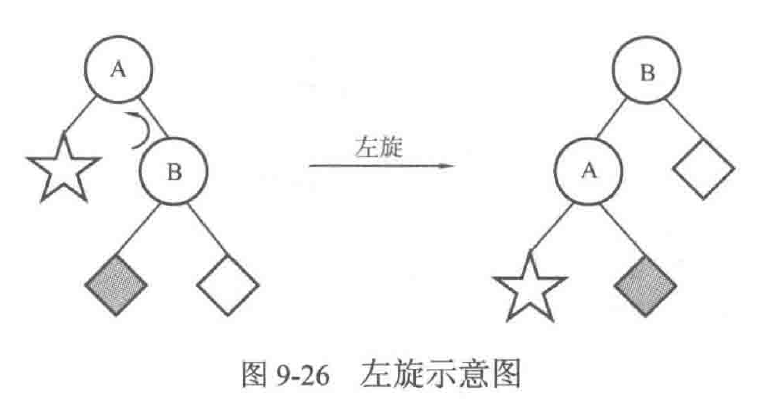

  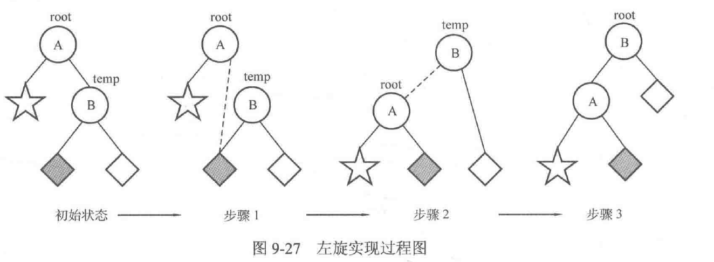

  * 让B的左子树称为A的右子树。
  * 让A成为B的左子树。
  * 将根结点设定为结点B。
  * 总结：先给再合并，最后设根结点。

  ```cpp
  // 左旋（left Rotation）
  void L(node* &root) {
      node* tmp = root->rchild;
      root->rchild = tmp->lchild;
      tmp->lchild = root;
      
      updateHeight(root); // 一定要记住更新操作
      updateHeight(tmp);
      
      root = tmp;
  }
  ```

* AVL的右旋

```cpp
// 右旋（right Rotation）
void R(node* &root) {
    node* tmp = root->lchild;
    root->lchild = tmp->rchild;
    tmp->rchild = root;
    
    updateHeight(root);
    updateHeight(tmp);
    
    root = tmp;
}
```

* 插入操作

对某个结点，如果其符合AVL，则左右子树高度差不超过1，极端情况有左大右小（差为1），左小右大（差为1），第一种情况，左边高度+ 1，则差为2，第二种则为-2。因此，插入之后平衡因子只能是2或者-2。

**失衡结点一定发生在根结点和插入点之间，并且，只要把最靠近插入结点的失衡结点调整正常，则所有结点均平衡。**

假设结点A的平衡因子是2，即左 > 右为2，

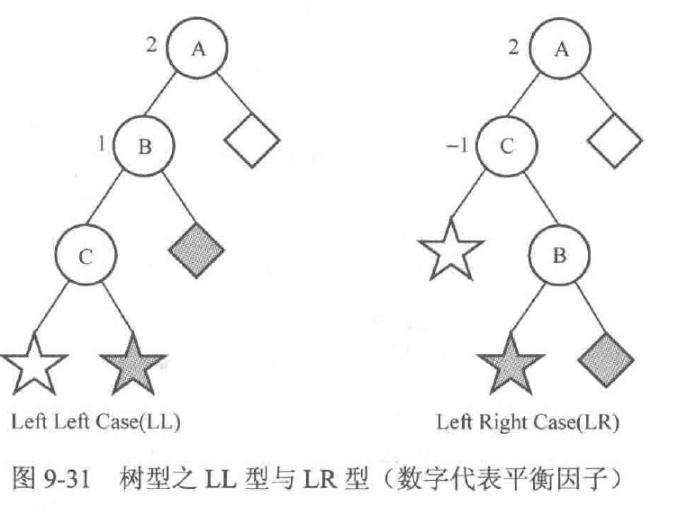

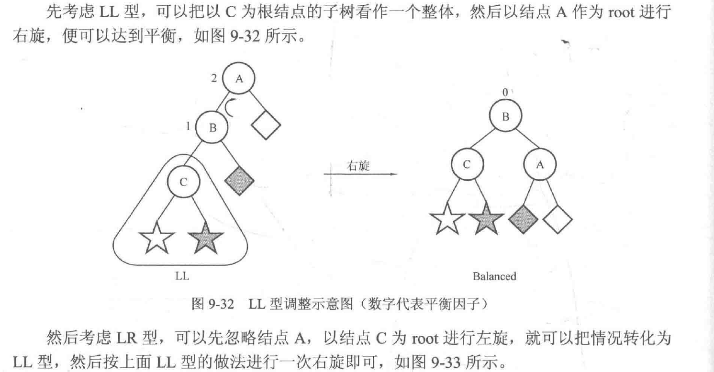

代码不写了。

## 17. 并查集

并（union合并）查（find查找）集（set集合），也就是包含了下面三个操作。

并查集使用数组实现，`int father[N]`，其中`father[1] = 2`即表示元素1的父亲结点是元素2。

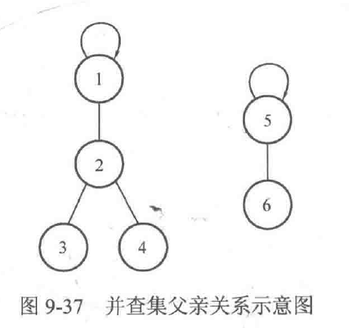

并查集使用首先是需要先初始化father数组，再根据需要进行查找或者合并。

### 17.1 初始化

一开始时 ，每个元素属于一个集合。

```cpp
for (int i = 1; i <= N; i ++) 
    father[i] = i;
```

### 17.2 查找

```cpp
// findFather 函数返回元素x所在集合的根结点
int findFather(int x) { // 只要不是根结点，就一直向上找
    while (x != father[x])
        x = father[x];
    
    return x;
}
```

### 17.3 合并

合并是指将两个集合合并成一个集合，即先判断是否属于一个集合，若不属于，则将一个集合的father改为另一个集合的根结点。

```cpp
void Union(int a, int b) {
    int faA = findFather(a);
    int faB = findFather(b);
    if (faA != faB)
        father[faA] = faB;
}
```

### 17.4 并查集的优化

如果每次都要向上查询才能知道某个结点的根结点，效率太低。优化的方法是将每个结点的father[x]设置为根结点：

```cpp
int findFather(int x) { // 查询过程中顺便将所有的结点的father[x]设置为根结点
    int a = x; // 后续x会变，先存下来
    while (x != father[x])
        x = father[x];
  	
    // 此时，x中存放的就是根结点
    while (a != father[a]) {
        int z = a; // 后续a会变，先存下来
        a = father[a];
        father[z] = x;
    }
    
    return x;
}
```

## 18. 堆

### 18.1 堆的基本概念和操作

堆实质上是一棵完全二叉树，若父亲结点值 >= 孩子结点的值，则为大顶堆，反之为小顶堆。

这里要注意，**完全二叉树对左右子树无大小要求，堆在此基础上增加了大小要求，并且，左右子树一定比根结点小（大顶堆），但左右子树之间没有明确比较。**

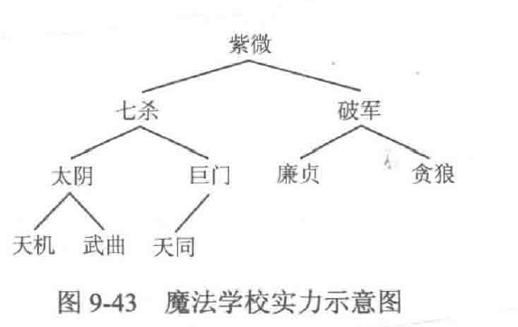

完全二叉树有一个特点，假设某结点是数组i号位，则其左孩子是2i号位，右孩子是2i+1（按照层次遍历）。

```cpp
// 定义堆
const int maxn = 100;
int heap[maxn], n = 10;
```

每一次调整，都是将结点从上往下的调整，将当前结点和其左右孩子的最大结点进行交换。

```cpp
// heap数组在[low, high]范围内进行向下调整
// low是指欲调整结点的数组下标，high为堆的最后一个元素的数组下标
void downAdjust(int low, int high) {
    int i = low, j = 2 * i; // j为左孩子
    while (j <= high) { // 有左孩子
    	if (j + 1 <= high && heap[j + 1] > heap[j]) { // 有右孩子且右孩子权值更大
        	j = j + 1;
        }
        if (heap[j] > heap[i]) {
            swap(heap[j], heap[i]);
            i = j;
            j = i * 2;
        }else break;
    }
}
```

假设序列中元素个数为n，则说明非叶子结点为（n/2 向下取整)，因此我们可以从（n/2 向下取整）开始遍历，倒着调整。

```cpp
// 建堆
void createHeap() {
    for (int i = n / 2; i >= 1; i --)
        downAdjust(i, n);
}
```

可以说是**肥肠煎蛋**。

**添加一个元素**，将元素放在最后，然后向上调整，遇见父结点比自己小，则交换，直到到达堆顶或者父结点权值更大为止。

```cpp
// 对heap数组在[low, high]范围进行向上调整
// low设置为1，high表示欲调整结点的数组下标
void upAdjust(int low, int high) {
    int i = high, j = i / 2;
    while (j >= low) {
        if (heap[i] > heap[j]) {
            swap(heap[i], heap[j]);
            i = j;
            j = i / 2;
        }else break;
    }
}
```

```cpp
// 添加元素x
void insert(int x) {
    heap[++ n] = x;
    upAdjust(1, n);
}
```

### 18.2 堆排序

假设是大根堆，堆排序的核心思路是首先取出堆顶，然后将堆顶元素和堆的最后一个元素进行交换，然后进行一次向下调整，再次产生堆顶元素即可。

具体到代码，可以倒着遍历数组，假设当前访问到i号位，则将i号位和堆顶元素交换，然后[1, i - 1]范围内对堆顶元素进行一次向下调整。

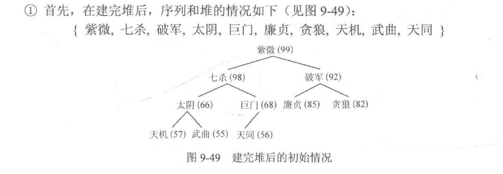

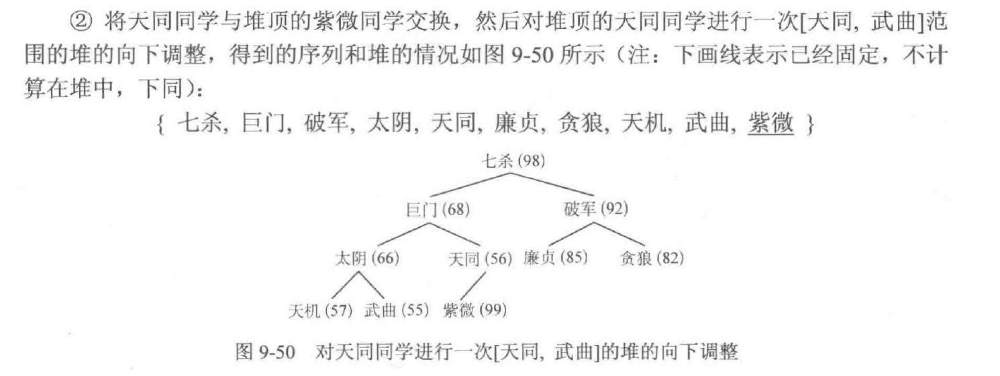

```cpp
// 堆排序
void heapSort() {
    createHeap();
    for (int i = n; i > 1; i --) {
        swap(heap[i], heap[1]);
        downAdjust(1, i - 1);
    }
}
```

## 19. 哈夫曼树

### 19.2 哈夫曼树概念和基本操作

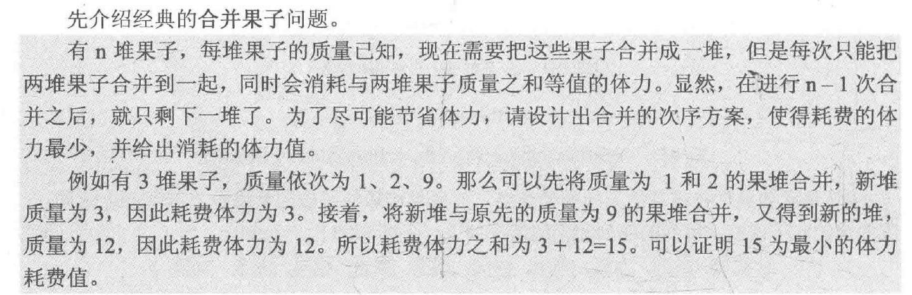

以合并1 2 2 3 6五堆果子为例，它们的最小体力应该是32。

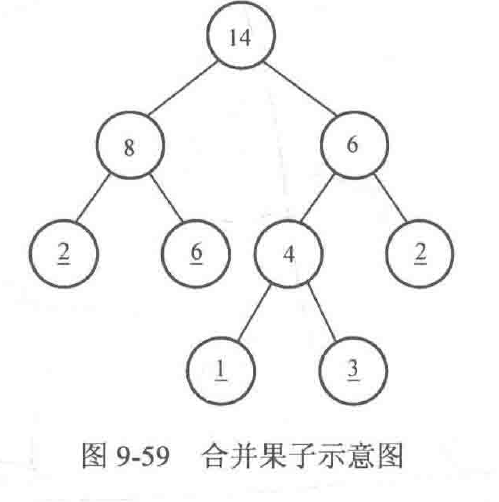

有以下两种方式计算：

* 所有非叶子结点之和。
* 每一个叶子结点乘以路径，全部乘积总和。

可以将叶子结点乘以其路径长度称之为**带权路径长度**。其中带权路径长度最小的树称之为**哈夫曼树。**

问题可以抽象为：已知n个数，寻找一棵树，使得树的所有叶子结点的权值恰好为这n个数，并且带权路径长度最小。

可以使用**堆结构（优先队列）**来实现，初始时将果堆质量压入小顶堆，之后从小顶堆中取出两个最小的数，将她们相加之后重新压入小顶堆，重复至小顶堆只剩下一个数。

```cpp
#include <cstdio>
#include <queue>
using namespace std;

// 小顶堆
priority_queue<long long, vector<long long>, greater<long long>> q;

int main() {
    int n;
   	long long tmp, x, y, ans = 0; // tmp表示临时输入存储 ans存储相加结果
    scanf("%d", &n);
    
    for (int i = 0; i < n; i ++) {
        scanf("%lld", &tmp);
        q.push(tmp);
    }
    
    while (q.size() > 1) { // 直到小顶堆只有1个元素
        x = q.top();
        q.pop();
        y = q.top();
        q.pop();
        
        q.push(x + y);
        ans += x + y;
    }
    
    printf("%lld\n", ans);
    return 0;
}
```

### 19.2 哈夫曼编码

如果对于二叉树，左分支标记为0、右分支标记为1。**对任意一个结点，从根结点到该结点的编号都是唯一的，且对于任何一个叶子结点，其编号一定不会称为其他任何一个结点编号的前缀。**

这有什么用呢，实际上，哈夫曼编号用于翻译工作非常有用，可以防止计算机读了一部分字符串之后产生歧义。

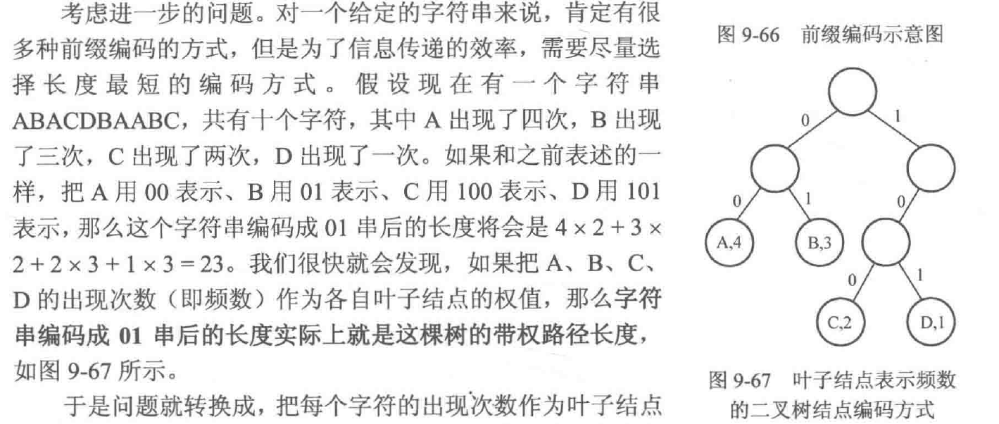

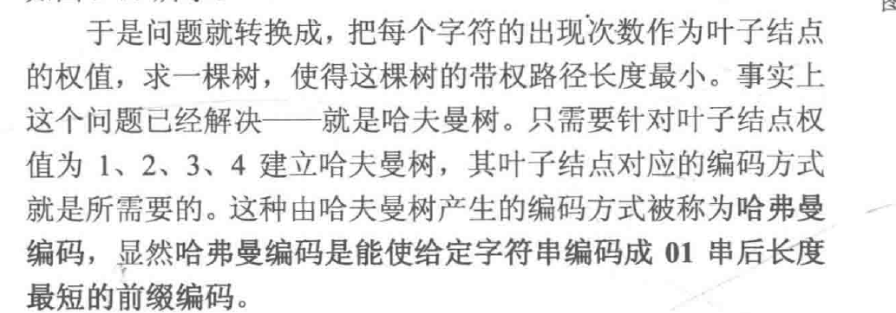

## 20. 图

### 20.1 图的基本概念

有向图：所有边都有方向。

无向图：所有的边都是双向。

可以将无向图看成所有边都是由正向和负向两条有向边组成的特殊有向图。

度：和顶点相连的边的条数，入度和出度同理。

权值：对于顶点和边，都可以赋予一定属性，即点权和边权。

### 20.2 图的存储

#### 20.2.1 邻接矩阵存储图

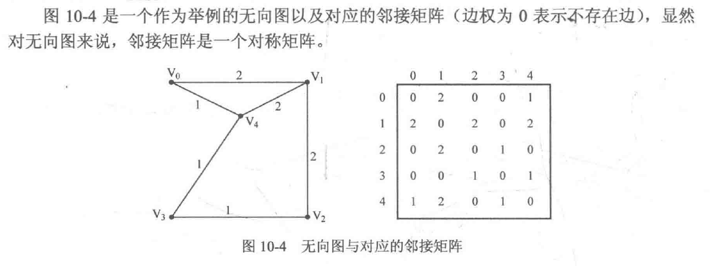

#### 20.2.2 邻接表存储图

对每个顶点，使用链表来存储出边，例如对于下图：

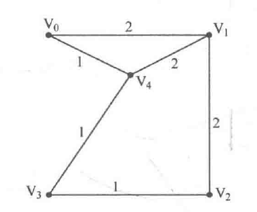

建立下面的链表来进行存储。

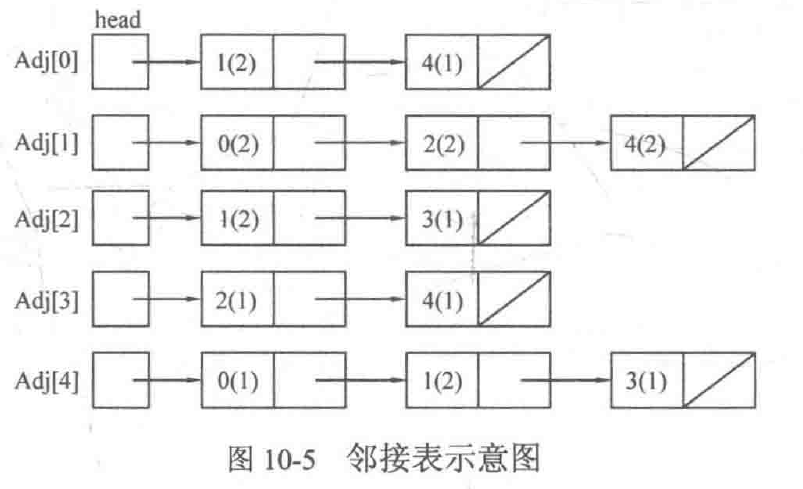

更简便的方法是使用vector来进行存储：

定义结构体来存储边的终点编号和权值：

```cpp
struct Node {
    int v; // 边的终点编号
    int w; // 边权
}
```

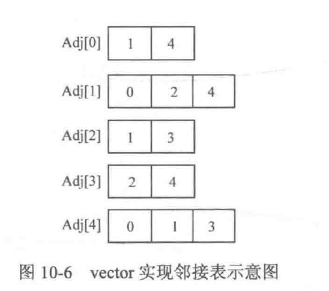

那么对于Adj[0]，添加一个从1号到达3号顶点的有向边，就可以有：

```cpp
vector<Node> Adj[N];

Node tmp;
tmp.v = 3;
tmp.w = 4;
Adj[1].push_back(tmp);
```

### 20.2 图的遍历

#### 20.2.1 DFS遍历图

* 连通分量

**在无向图中**，若两个顶点之间可以相互到达，则称两个顶点连通；若图的任意两个顶点都连通，则称G为连通图，其中，**极大连通子图为连通分量。**

* 强连通分量

**在有向图中**，若两个顶点之间可以相互到达，则称两个顶点强连通；若图的任意两个顶点都强连通，则称G为强连通图，其中，**极大强连通子图为强连通分量。**

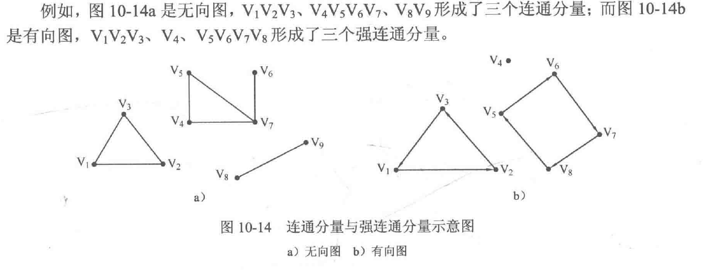

* 连通块

将连通分量和强连通分量均称为连通块。

* DFS思路

DFS需要保证对所有的连通块进行遍历，遍历过的顶点设置为已访问，下次递归则直接跳过，直到图中所有顶点都标记为已访问。

```cpp
// 邻接矩阵DFS版

vector<int> Adj[MAXV];
int n; // n为顶点数，MAXV为最大顶点数
bool vis[MAXV] = {false};

void DFS(int u, int depth) { // u为当前访问顶点标号，depth为深度
	vis[u] = true; // u已访问
    for (int i = 0; i < Adj[u].size(); i ++) { // 从u出发
    	int v = Adj[u][i];
        if (vis[v] == false)
            DFS(v, depth + 1);
    }
}

void DFSRTrave() { // 遍历图G
	for (int u = 0; u < n; u ++) 
        if (vis[u] == false)
            DFS(u, 1);
}
```


BFS暂时不学了

## 21. 最短路径

最短路径是指求从起点到终点，所经过路径的所有边的边权之和最小。

### 21.1 Dijkstra算法

**解决单源最短路问题，即给定图G和起点s，求s到其它每个顶点的最短距离。**

算法思路：

对于G(V,E)，建立集合S用来存放已经访问过的顶点。每次从V - S，即未被访问过的顶点集中选择一个与s最近的顶点u，将u加入S，并且借助u做为中介点，优化s和所有u能达到的顶点v之间的最短距离。重复执行n次，直到S包含所有顶点。

```cpp
// Dijkstra 伪代码
// G为图，一般设为全局变量 数组d为源点到各点的最短路径 s为起点
Dijkstra(G, d[], s) {
    初始化
    for (循环n次) {
        u = 使d[u]最小的还未被访问的顶点的标号
        
        标记u已被访问
        
        for (从u出发的所有能到达的顶点v) {
            if (v未被访问 && 以u为中介点使s到顶点v的最短距离d[v]更优，则优化d[v])
        }
    }
}
```

```cpp
// 邻接矩阵版 Dijkstra

const int MAXV = 1000; // 最大顶点数
const int INF = 0x3fffffff; // 设INF为一个很大的数
struct Node {
    int v, dis; // v为边的目标顶点，dis为边权
};
vector<Node> Adj[MAXV]; // Adj[u]存放从u出发可以到达的所有顶点
int n; // n为顶点数
int d[MAXV]; // 起点到达各点的最短路径长度
bool vis[MAXV] = {false};

void Dijkstra(int s) { // s为起点
	fill(d, d + MAXV, INF); // 将d数组赋值为INF
    
    d[s] = 0; // 起点s到达自身的距离为0
    
    for (int i = 0; i < n; i ++) { // 循环n次
    	int u = -1, MIN = INF; // u使d[u]最小，MIN存放最小的d[u]
        for (int j = 0; j < n; j ++) { // 找到未访问的顶点中d[]最小的
        	if (vis[j] == false && d[j] < MIN) {
                u = j;
                MIN = d[j];
            }
        }
        
        // 找不到小于INF的d[u]，说明剩下的顶点和起点s不连通
        if (u == -1) return ;
        
        vis[u] = true; // 标记u已经访问
        
        for (int j = 0; j < Adj[u].size(); j ++) {
            int v = Adj[u][j].v;
            if (vis[v] == false && d[u] + Adj[u][j].dis < d[v])
                d[v] = d[u] + Adj[u][j].dis;
        }
    }

}
```

```cpp
const int MAXV = 1000; // 最大顶点数
const int INF = 0x3fffffff; // 将该距离设置为不可达

struct Node {
    int v, dis; // 终点和边权
};

vector<Node> Adj[MAXV]; // Adj[u]存放从u出发可到达的所有顶点
int n;
int d[MAXV]; // 存放起点s到某点的最短路径
bool vis[MAXV] = {false}; // 某点是否被访问

void Dijkstra(int s) {
    fill(d, d + n, INF);
    d[s] = 0;
    
    for (int i = 0; i < n; i ++) {
        int u = -1, MIN = INF;
        for (int j = 0; j < n; j ++) {
            if (vis[j] == false && d[j] < MIN) {
                u = j;
                MIN = d[j];
            }
            
            if (u == -1) return ;
            
            vis[u] = true;
            
            for (int j = 0; j < Adj[u].size(); j ++) {
                int v = Adj[u][j].v;
                if (vis[v] == false && d[u] + Adj[u][j].dis < d[v])
                    d[v] = d[u] + Adj[u][j].dis;
            }
        }
    }
}
```

**上述的最短距离的求解，下面是求解最短路径。**

使用pre[v]表示从起点s到顶点v的最短路径上v的前一个顶点的编号。

```cpp
if (vis[v] == false && d[u] + Adj[u][j].dis < d[v]) {
    d[v] = d[u] + Adj[u][j].dis;
    pre[v] = u; // 记录v的前驱顶点是u
}
```

求解最短路径只需要递归即可。

```cpp
void DFS(int s, int v) {
    if (v == s) { // 如果已经到了起点s，则输出s并返回
    	printf("%d\n", s);
        return ;
    }
    
    DFS(s, pre[v]);
    printf("%d\n", v); // 从最深处return回来后，输出每一层的顶点
}
```

当然，很可能会出现符合最短距离的最短路径不止一条。题目常常会加上第二标尺，常见有：

* 给每条边再增加边权，例如费用，返回费用最小。
* 给每个点增加点权，例如每个点可获得钱数，使得钱数最多。
* 直接问有多少条最短路径。

例如对于问题1，用cost[u]\[v]表示u->v的花费，那我们可以增加一个数组c[]表示起点s到顶点u的最少花费c[u]。

```cpp
const int MAXV = 1000; // 最大顶点数
const int INF = 0x3fffffff; // 将该距离设置为不可达

struct Node {
    int v, dis; // 终点和边权
};

vector<Node> Adj[MAXV]; // Adj[u]存放从u出发可到达的所有顶点
int n;
int d[MAXV]; // 存放起点s到某点的最短路径
bool vis[MAXV] = {false}; // 某点是否被访问

void Dijkstra(int s) {
    fill(d, d + n, INF);
    d[s] = 0;
    
    for (int i = 0; i < n; i ++) {
        int u = -1, MIN = INF;
        for (int j = 0; j < n; j ++) {
            if (vis[j] == false && d[j] < MIN) {
                u = j;
                MIN = d[j];
            }
            
            if (u == -1) return ;
            
            vis[u] = true;
            
            for (int j = 0; j < Adj[u].size(); j ++) {
                int v = Adj[u][j].v;
                if (vis[v] == false && d[u] + Adj[u][j].dis < d[v]) { // 以u为中介点可以更优
                    d[v] = d[u] + Adj[u][j].dis;
                    pre[v] = u; // 记录v的前驱顶点是u
                    
                    c[v] = c[u] + cost[u][v];
                }else if (vis[v] == false && d[u] + Adj[u][j].dis == d[v] && c[u] + cost[u][v] < c[v]) { // 若相等则使用花费
                	c[v] = c[u] + cost[u][v];
                }
        }
    }
}
```

对于问题2，新增点权，用weight[u]表示某点的点权u，并增加一个数组w[]，令从起点s到达顶点u可以收集到的最大物资为w[u]。

```cpp
const int MAXV = 1000; // 最大顶点数
const int INF = 0x3fffffff; // 将该距离设置为不可达

struct Node {
    int v, dis; // 终点和边权
};

vector<Node> Adj[MAXV]; // Adj[u]存放从u出发可到达的所有顶点
int n;
int d[MAXV]; // 存放起点s到某点的最短路径
bool vis[MAXV] = {false}; // 某点是否被访问

void Dijkstra(int s) {
    fill(d, d + n, INF);
    d[s] = 0;
    
    for (int i = 0; i < n; i ++) {
        int u = -1, MIN = INF;
        for (int j = 0; j < n; j ++) {
            if (vis[j] == false && d[j] < MIN) {
                u = j;
                MIN = d[j];
            }
            
            if (u == -1) return ;
            
            vis[u] = true;
            
            for (int j = 0; j < Adj[u].size(); j ++) {
                int v = Adj[u][j].v;
                if (vis[v] == false && d[u] + Adj[u][j].dis < d[v]) { // 以u为中介点可以更优
                    d[v] = d[u] + Adj[u][j].dis;
                    pre[v] = u; // 记录v的前驱顶点是u
                    
                    w[v] = w[u] + weight[v];
                }else if (vis[v] == false && d[u] + Adj[u][j].dis == d[v] && w[u] + weight[u][v] > w[v]) { // 若相等则使用花费
                	w[v] = w[u] + weight[v];
                }
        }
    }
}
```


### 21.2 Bellman-Ford算法和SPFA算法

**Dijkstra算法很好解决了无负权图的最短路径问题，**为解决有负权图的最短路径问题，引入Bellman-Ford（BF算法）。

与环相关，跳过，后续再看。

### 21.3 Floyd算法

Floyd算法是用来解决**全源最短路径问题**，即对于给定G(V,E)，求任意两点u，v之间的最短路径长度。Floyd算法时间复杂度是O(n^3)，因此一般使用邻接矩阵来实现。

Floyd算法基于以下事实，如果存在顶点k，使得以k作中介点时顶点i和顶点j的当前距离缩短，则使用顶点k作为i和j的中介点。即dis[i]\[k] + dis[k]\[j] < dis[i]\[j]时，令dis[i]\[j] = dis[i]\[k] + dis[k]\[j]。

伪代码如下：

```cpp
枚举顶点 k (k 属于[1, n])
    以顶点k作为中介点，枚举所有顶点对i和j
    	如果dis[i][k] + dis[k][j] < dis[i][j]成立
    		则更新
```

```cpp
#include <cstdio>
#include <algorithm>
using namespace std;

const int INF = 0x3fffffff;
const int MAXV = 200; // 最大顶点数
int n, m;
int dis[MAXV][MAXV];

void Floyd() {
    for (int k = 0; k < n; k ++)
        for (int i = 0; i < n; i ++)
            for (int j = 0; j < n; j ++)
                if (dis[i][k] != INF && dis[k][j] != INF && dis[i][k] +dis[k][j] < dis[i][j])
                    dis[i][j] = dis[i][k] + dis[k][j];
}

int main() {
    int u, v, w;
    fill(dis[0], dis[0] + MAXV * MAXV, INF);
    scanf("%d%d", &n, &m); // 顶点数n 边数m
    for (int i = 0; i < n; i ++)
        dis[i][i] = 0; // 顶点i到i的距离为0
    for (int i = 0; i < m; i ++) {
        scanf("%d%d%d", &u, &v, &w);
        dis[u][v] = w;
    }
    
    Floyd(); 
    
    for (int i = 0; i < n; i ++) {
        for (int j = 0; j < n; j ++)
            printf("%d ", dis[i][j]);
        printf("\n");
    }
    
    return 0;
}
```

## 22. 最小生成树

Prim和Kruskal算法，暂时略过。

## 23. 拓扑排序

暂时略过

## 24. 动态规划

Dynamic Programming DP问题，将一个复杂问题分解为子问题，通过求解子问题来求解问题，且会将**求解子问题的过程记录**，下次求解同样子问题时，可以直接使用。

一般使用递归或递推实现，递归实现常常称之为**记忆化搜索。**

对于斐波那契数列求解，我们可以开一个dp[]来存储计算结果：

```cpp
int F(int n) {
    if (n == 0 || n == 1) return ;
    if (dp[n] != -1) return dp[n];
    else {
        dp[n] = F(n - 1) + F(n - 2);
        return dp[n];
    }
}
```

对于典型的数塔问题，求解所有路径所有数字相加最大和，可以使用dp[i]\[j]来存储每个结点到底层的最大路径。

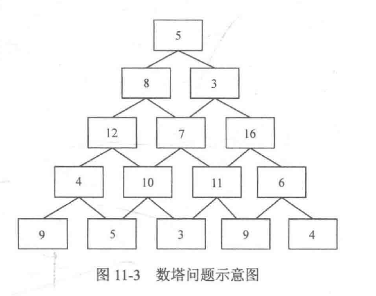

那么，对于最上层的`d[1][1] = max(dp[2][1], dp[2][2]) + f[1][1]`

称这种方式为**状态转移方程。**

```cpp
#include <iostream>
using namespace std;
const int maxn = 1000;
int f[maxn][maxn], dp[maxn][maxn];

int main() {
    int n;
    scanf("%d", &n);
    for (int i = 1; i <= n; i ++)
        for (int j = 1; j <= i; j ++)
            scanf("%d", &f[i][j]);
    
    for (int j = 1; j <= n; j ++)
        dp[n][j] = f[n][j];
    
    for (int i = n - 1; i >= 1; i --)
        for (int j = 1; j <= i; j ++)
            dp[i][j] = max(dp[i + 1][j], dp[i + 1][j + 1]) + f[i][j];
    
    printf("%d\n", dp[1][1]);
    retu
}
```


